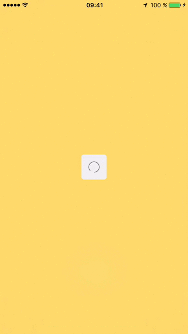
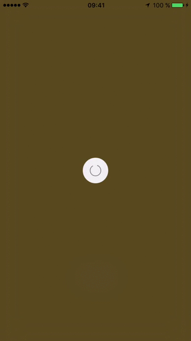

# AWLoader

[](#)




A loader that looks like the iOS Apple Store application.

**❕It's smoother on a real app.  Try it by youself.

## Requirements

```swift
guard ios >= 8  else { return }
```

## Installation

### Manually

Simply drag and drop the `AWLoader.swift` file to your project.

## Usage

To show the loader, use the following code :

```swift
AWLoader.show()
AWLoader.hide()
```

It's also customizable, you can change the blur style ( ExtraLight, Light and Dark ) as well as the shape of the loader ( Circle or Square by default )

```swift
AWLoader.show(blurStyle: .Dark, shape: .Circle)
```

## Author

Rebouh Aymen, aymenworks@gmail.com

Twitter [@aymenworks](https://twitter.com/aymenworks)

## License

AWLoader is available under the MIT license. See the LICENSE file for more info.
