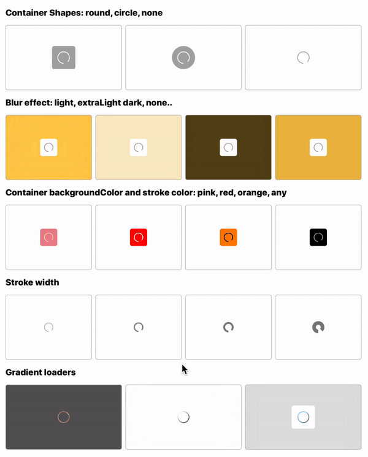
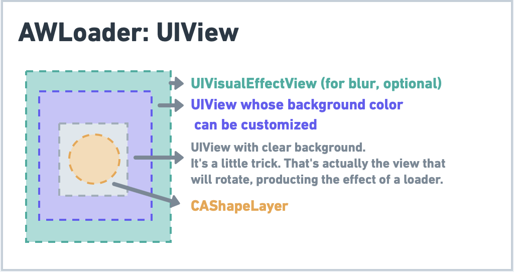

# AWLoader
 
AWLoader is a UI  Compoonent that allows you to integrate loader that fits your needs within your app.

## Overview

### Appareance



###  Behind the scenes

As simple as:


## 🔶 Requirements

- iOS 9.0+
- Swift 5.0

## 👨🏻‍💻 Usage

### Normal loader

#### Usage
```swift
let loader = AWLoader(showInView: view,
                      animationDuration: 1,
                      blurStyle: .light,
                      shape: .rounded(6),
                      containerBackgroundColor: .white,
                      lineWidth: 2,
                      lineColor: .darkGray)
loader.show()

DispatchQueue.main.asyncAfter(deadline: .now() + 2) {
    loader.hide()
}
```

#### Customization

Those properties:
```swift
public init(showInView presentingView: UIView,
                animationDuration: CFTimeInterval = 1.5,
                blurStyle: UIBlurEffect.Style? = .light,
                shape: AWLoaderShape = .rounded(6),
                containerBackgroundColor: UIColor = .lightGray,
                lineWidth: CGFloat = 2,
                lineColor: UIColor = .black
                )
```

### Gradient loader

#### Usage
```swift
let gradientLoader = AWGradientLoader(showInView: self.view,
                                      animationDuration: 0.7,
                                      blurStyle: .dark,
                                      shape: .rounded(6),
                                      containerBackgroundColor: .white,
                                      gradientColors: [.purple, .black, .purple],
                                      gradientLocations: [0.2, 0.5, 1])
gradientLoader.show()

DispatchQueue.main.asyncAfter(deadline: .now() + 2) {
    gradientLoader.hide()
}
```

#### Customization

Those properties:
```swift
public init(showInView presentingView: UIView,
              animationDuration: CFTimeInterval = 1.5,
              blurStyle: UIBlurEffect.Style? = nil,
              shape: AWLoaderShape = .circle,
              containerBackgroundColor: UIColor = .lightGray,
              lineWidth: CGFloat = 2,
              gradientColors: [UIColor],
              gradientLocations: [NSNumber]
      )
```

## Installation

### CocoaPods

```pod 'AWLoader'```

### Carthage

```github "Aymenworks/AWLoader"```


## License

AWStepBar is released under the MIT license.
